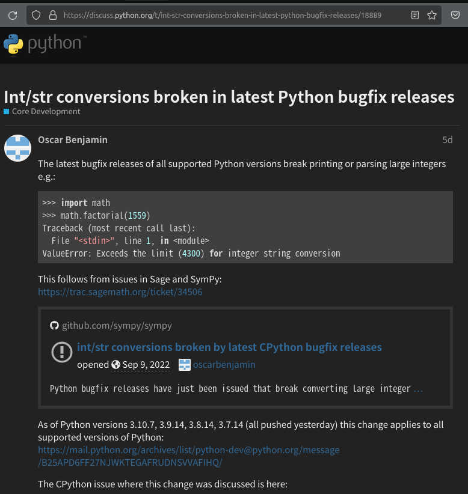

:::message
一部加筆修正しました(2022年9月14日15時46分)
:::

# int/str型変換における破壊的変更のお知らせ
こんにちは。東海顔認証のyKesamaruです。

https://www.youtube.com/watch?app=desktop&v=eTucYT2LpNU
今さっき上記YouTubeで知ったのですが、なかなかのニュースが飛び込んできました。

**2022年9月7日水曜日、Pythonにおいて下位互換性を破壊するセキュリティーアップデートが緊急でリリースされました。**

すくなからずプロジェクトに変更を強いられるケースが発生するかもしれません。といってもこのケースに当てはまるならばきちんと修正したほうが良い内容ではあります。
さきほど検索してみましたが自分が観測した限りでは唯一窓の杜さんがさらっと触れています。
[「Python」に定例外のセキュリティアップデート](https://forest.watch.impress.co.jp/docs/news/1438284.html)
他に紹介しているサイトがありましたらごめんなさい。

詳細は続報が色々なサイトで報じられると思いますので取り急ぎざっとまとめます。間違いがありましたらお知らせいただけると幸いです。

## 特に注意が必要なユーザー
- `SymPy`を直接あるいは間接的に利用している

## 今分かっている対処法
- 環境変数またはコマンドラインフラグを使用して制限を設定、その後にPythonを再起動
[Configuring the limit](https://docs.python.org/3/library/stdtypes.html#configuring-the-limit)
https://docs.python.org/3/library/stdtypes.html#configuring-the-limit


詳細は以下で紹介している[こちら](https://discuss.python.org/t/int-str-conversions-broken-in-latest-python-bugfix-releases/18889)をご参照ください。

## 概略
> （意訳）
> 潜在的なサービス拒否攻撃を回避するため、2(2進数)、4、8(8進数)、16(16進数)、10(10進数)などでintとstrの相互変換を行うとValueErrorを出すようにしました。
対象:3.10.7、3.9.14、3.8.14、および3.7.14

さて公式では以下から参照が可能です。
https://blog.python.org/2022/09/python-releases-3107-3914-3814-and-3714.html


> Converting between int and str in bases other than 2 (binary), 4, 8 (octal), 16 (hexadecimal), or 32 such as base 10 (decimal) now raises a ValueError if the number of digits in string form is above a limit to avoid potential denial of service attacks due to the algorithmic complexity.
Security releases for 3.9.14, 3.8.14, and 3.7.14 are made available simultaneously to address this issue, along with some less urgent security content.

## 発端
もともとは以下のissueが発端とされています。
**CVE-2020-10735: Prevent DoS by large int<->str conversions #95778**
https://github.com/python/cpython/issues/95778


> A huge integer will always consume a near-quadratic amount of CPU time in conversion to or from a base 10 (decimal) string with a large number of digits. No efficient algorithm exists to do otherwise.

つまり**極端に桁数の多いint/strの変換で大きなCPU時間を消費する**ため潜在的なDoS攻撃のもとになり得る…ということのようです。

## 検証コード
制限される桁数は4300のようです。上記YouTubeでは以下のコードで検証しています。
:::details 検証
```python
import math
# import sys


def char(digit):  # 0 -> "0"
    return chr(digit + 48)


def digit(character):  # "0" -> 0
    return ord(character) - 48


def int_to_str(n):  # requires n >= 0
    digits = []
    while True:
        n, r = divmod(n, 10)  # n // 10, n % 10
        digits.append(char(r))
        if n == 0:
            break

    return "".join(reversed(digits))


def str_to_int(s):  # requires result >= 0
    n = 0
    for ch in s:
        n = 10 * n + digit(ch)
    return n


def main():
    # sys.set_int_max_str_digits(0)
    answer = math.factorial(10000)
    print(f"{answer=}")


if __name__ == '__main__':
    main()
```
:::

消費される時間をプロットするために以下のコードが使われています。
:::details 消費時間計測
```python
import timeit

import matplotlib.pyplot as plt
import numpy as np
import pandas as pd


def main():
    N = 100000
    int_to_str = []
    test_nums = range(5000, N, 100)
    for n in test_nums:
        print(n)
        t = timeit.timeit("str(x)", f"x=10 ** {n}", globals=globals(), number=1)
        int_to_str.append((n, t))

    str_to_int = []
    for n in test_nums:
        print(n)
        t = timeit.timeit("int(s)", f"s='1'+ '0' * {n}", globals=globals(), number=1)
        str_to_int.append((n, t))

    int_to_str = pd.DataFrame.from_records(int_to_str, columns=["n", "t"])
    str_to_int = pd.DataFrame.from_records(str_to_int, columns=["n", "t"])

    linewidth = 3.0
    plt.figure(figsize=(16, 9))
    plt.title("str/int conversion times")
    plt.xlabel("$n$ digits")
    plt.ylabel("$t$ time")
    plt.plot(int_to_str["n"], int_to_str["t"], label="int to str", color="tab:blue", linewidth=linewidth)
    plt.plot(str_to_int["n"], str_to_int["t"], label="str to int", color="tab:orange", linewidth=linewidth)
    plt.legend()
    plt.show()

    plt.figure(figsize=(16, 9))
    plt.title("log-log str/int conversion times")
    plt.xlabel(r"$\log(n)$ digits")
    plt.ylabel(r"$\log(t)$ time")
    int_to_str.loc[:, "log_t"] = np.log(int_to_str["t"])
    int_to_str.loc[:, "log_n"] = np.log(int_to_str["n"])
    str_to_int.loc[:, "log_t"] = np.log(str_to_int["t"])
    str_to_int.loc[:, "log_n"] = np.log(str_to_int["n"])
    polyfit_log_int_to_str = np.poly1d(np.polyfit(int_to_str["log_n"], int_to_str["log_t"], deg=1))
    polyfit_log_str_to_int = np.poly1d(np.polyfit(str_to_int["log_n"], str_to_int["log_t"], deg=1))

    plt.plot(int_to_str["log_n"], int_to_str["log_t"], label="int to str", color="tab:blue", linewidth=linewidth)
    plt.plot(int_to_str["log_n"], polyfit_log_int_to_str(int_to_str["log_n"]), color="black", linestyle="dashed",
             label=f"$\\log t = {polyfit_log_int_to_str.c[0]:+.2f}\\,\\log n {polyfit_log_int_to_str.c[1]:+.2f}$")

    plt.plot(str_to_int["log_n"], str_to_int["log_t"], label="str to int", color="tab:orange", linewidth=linewidth)
    plt.plot(str_to_int["log_n"], polyfit_log_str_to_int(str_to_int["log_n"]), color="black", linestyle="dashed",
             label=f"$\\log t = {polyfit_log_str_to_int.c[0]:+.2f}\\,\\log n {polyfit_log_str_to_int.c[1]:+.2f}$")

    plt.legend()
    plt.show()


if __name__ == '__main__':
    main()
```
:::

結果は以下のようになります。
- str/int conversion times
  

- log-log str/int conversion times
  

これらをみて分かるように、適切なサニタイズをしていなければこれらの変換を利用した攻撃を受ける可能性があります。
もしこれらの問題に興味があれば[Int/str conversions broken in latest Python bugfix releases](https://discuss.python.org/t/int-str-conversions-broken-in-latest-python-bugfix-releases/18889)を参照してください。結構辛辣にまとめられています。例えば
> Presumably here it is the word “insecure” that justifies a potential SC exception. The OP of the issue suggests that this supposed vulnerability has been known about for over 2 years though. During that time many releases of Python were made and nothing was done to address this. Now when a potential fix arrives how is it so urgent that it should be backported to all release branches and released within days?
> （意訳）
> 2年間も放っておいて今更数日以内にリリースされなければならないって…。なぜこんなにも緊急なんでしょうね。

https://discuss.python.org/t/int-str-conversions-broken-in-latest-python-bugfix-releases/18889



それぞれ思うところはある…というところでしょうか。

もし該当コードが思い当たり、かつ今回のアップデート対象のバージョンを採用している場合は早めの対処が必要です。
続報を待ちましょう。